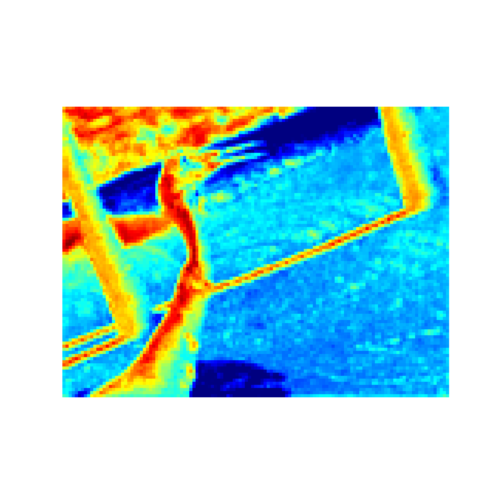
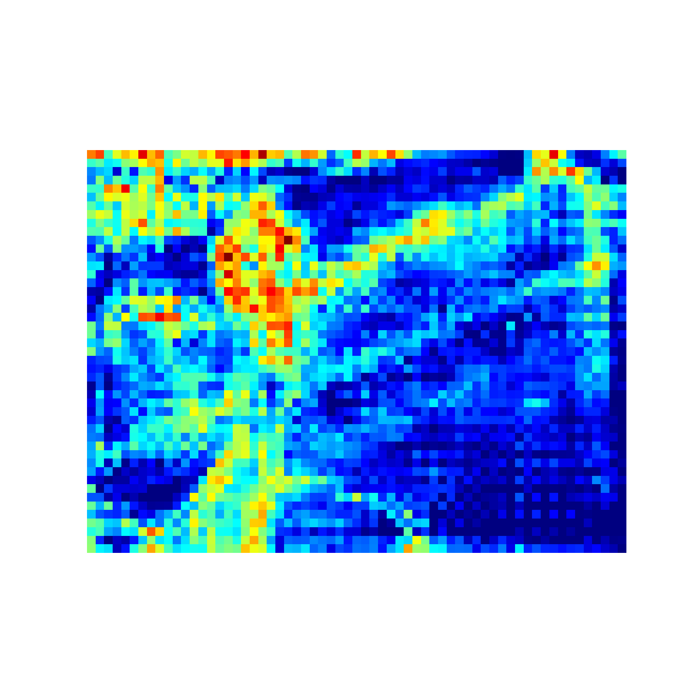
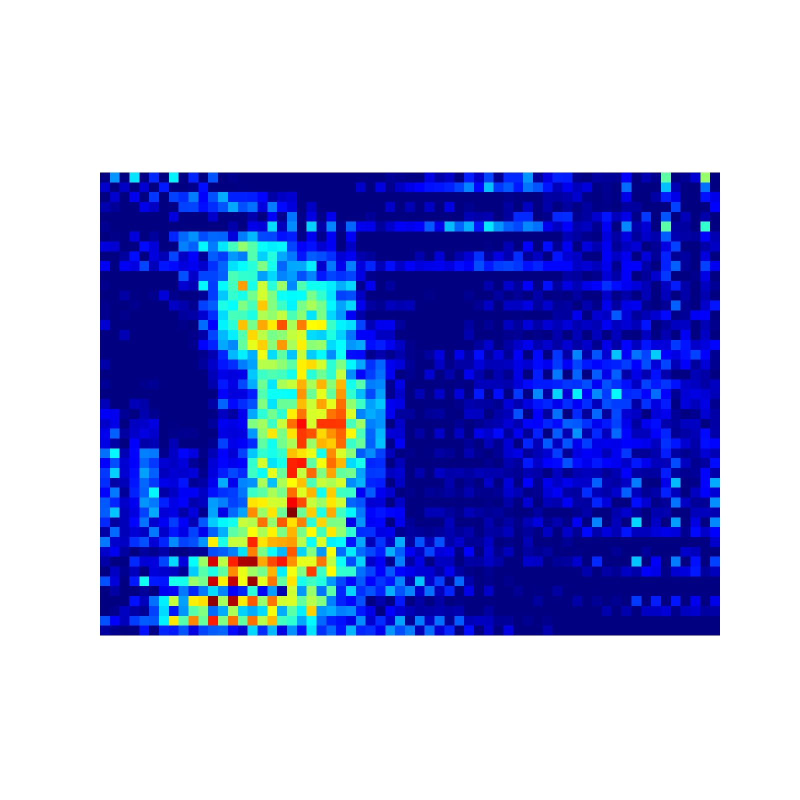
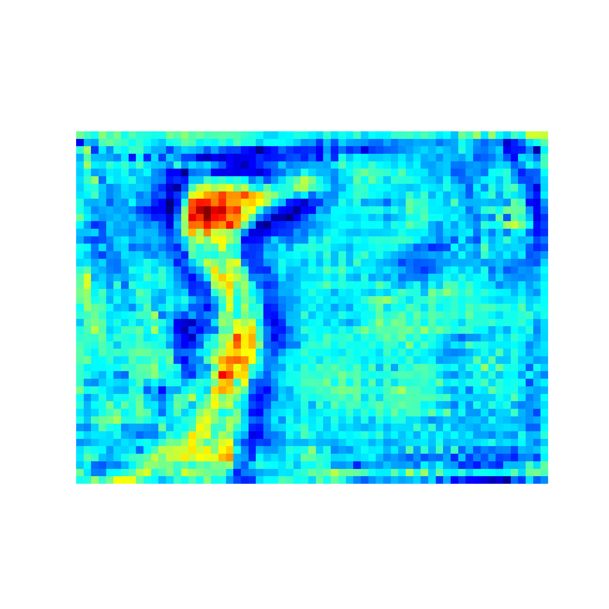
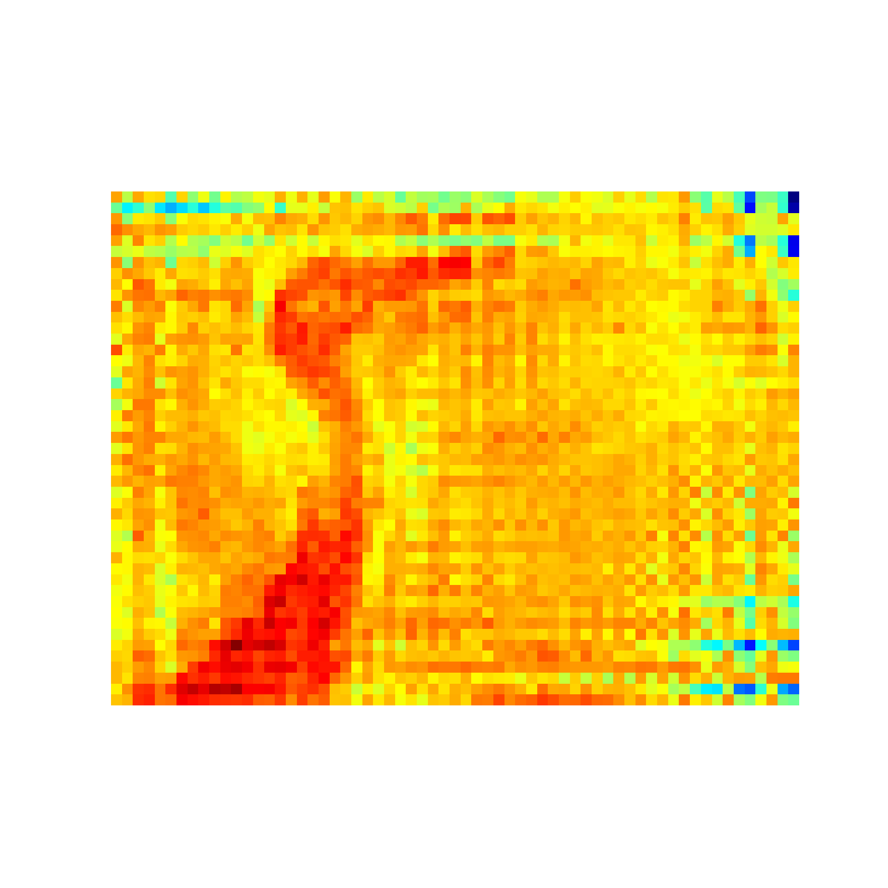
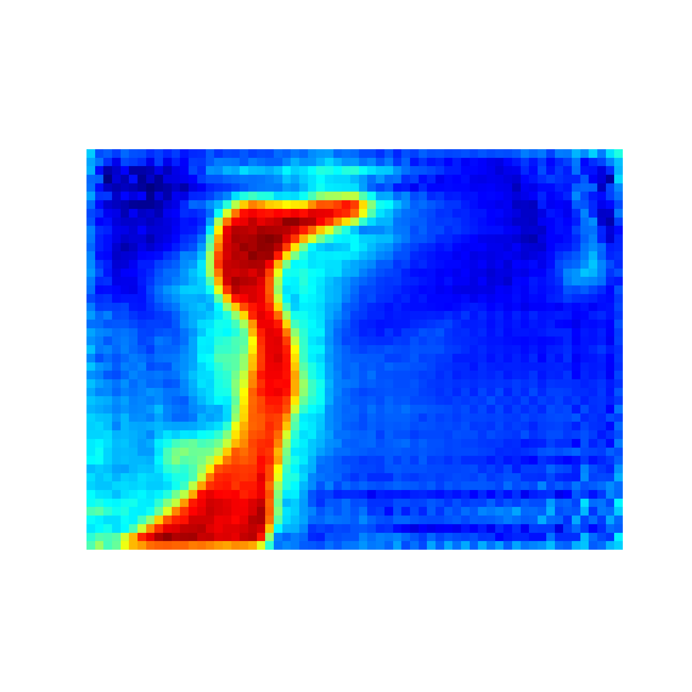
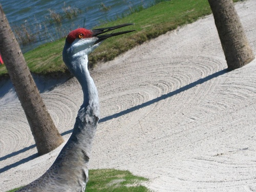
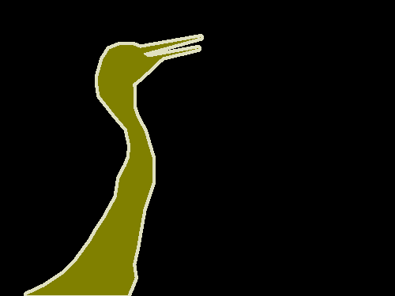
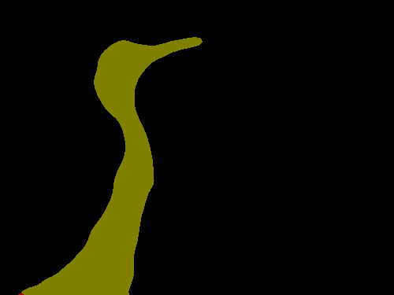

# net
### Abstracts
+ 在语义分割领域，将不同阶段的特征进行融合是常用的方法。低层特征具有较强的边界和纹理信息，而高层特征具有较强的语义信息，低层特征和高层特征具有较大的语义差距，直接将高层和低层特征进行融合会存在很大的噪声，直接融合并不能产生最好的效果。为了解决这个问题，我们遵循编码器和解码器的思想设计了一个并行金字塔网络，我们命名为NET。我们使用SEM来增强低层特征的特征值，使其具有更强的语义信息并缩短其与高层特征的语义差距。 我们使用PPM（金字塔池化模块）来聚合不同区域的上下文信息，并不断融合不同阶段的被SEM增强的特征（feature map）。将融合后的特征采用CAM来消除特征值融合后产生的噪声。最后，我们为了提取边界信息，设计了一个BEM在最后阶段获取边界信息并融合。我们在提出的并行金字塔网络中嵌入这四种模块从而达到对图像的精确分割。我们在三个数据集city、voc、camvid上进行实验验证我们网络的效果，最终都得到了最优的效果。
### 1.Introduce
+ 语义分割是计算机视觉领域一个非常活跃的研究方向，该技术的研究目的是对图像中的每个像素能够正确地预测出该像素属于的物体类别，它在视频监控、场景分析、人机交互以及行为分析等方面有着巨大的应用潜力。
+ State-of-the-art semantic segmentation are mostly based on the *fully convolutional network*(FCN).该方法的出色之处在于，其利用了现存的CNN网络作为其模块之一来产生层次化的特征。目前大多数的基于FCN的方法倾向于构建一个编码器分支来逐步获取语义信息，然后使用解码器来逐步恢复分辨率信息。experiences[24, 2, 3] show that ~~multi-scale~~（多阶段） information would help resolve ambiguous cases and results in more robust classification。为了捕捉多层次的上下文信息，跳跃连接在编码器和解码器的架构中经常被使用，跳跃连接将低层特征和高层特征进行融合，但是我们发现，这种架构存在很严重的问题，我们在使用跳跃连接来聚合特征时，没有考虑到低层信息和深层信息的语义鸿沟，直接将其进行融合会产生负面的效果。一些工作使用空洞卷积在使用低层特征前进行语义增强，缩短低层特征和高层特征之前的差距，但少有研究在特征融合后对融合后的特征值进行处理，消除融合后产生的噪声。我们展示一些feature heat map in Fig.1，
+ **写在图下作为解释：**(a),(b),(c)为FCN三个阶段不断加深的图(g)的热图，可以看出他们之前存在巨大的语义差距。(d)为(b)增强后的热图，其与(d)的差距明显小于(b)与(d)的差距。(e)为(b)和(c)做sum后产生的特征图。看出其噪声很大，产生了负面效果。(f)为(e)经过消除噪声的热图，(f)比(e)有更强的鲁棒性。

+ (a),(b),(c)是来自FCN三个阶段的特征图，我们发现越低层次的边界信息越明显，在fig(a)中我们很明显的能看出其边界和纹理（天空、柱子），但其干扰项太多，较为粗糙，不利于我们将其作为特征图进行精确分割。越深层次的特征(b)(c)边界信息越模糊，取而代之的是深层次的抽象的语义信息，其包含更多的鉴别和分类信息，可以用于分割。(e)展示了传统的跳跃连接将低层特征(b)和高层特征(c)sum后产生的结果，可以看出虽然特征图得到了加强，但其简单的sum后产生了很多噪声，产生了很多负面效果。所以，我们在特征融合时，不能忽略高层和低层特征之前的鸿沟。但目前工作很少有人提出解决方案。
+ 为了解决上述问题，我们认为在聚合不同阶段特征时，不能简单的将不同阶段的特征进行融合就进行使用。所以我们在使用不同阶段的低层特征前应尽可能的减少其与高层特征之间的语义差距。我们需要在融合不同尺度特征前后对特征图进行处理。在融合前我们应提高低层特征的语义信息，减小其边界和纹理信息，提取更强的语义信息，使得低层特征与高层之前具有较小的差异。在融合后，我们仍需要对融合后的特征图做处理，进一步消除噪声项。此外，我们发现最低层次的特征不利于做分割，但较低层的特征图被我们增强后会丢失大量边界信息，所以，我们需要一个模块来专门获取低层特征的边界信息。综上，我们提出了自己的网络来解决这个问题并提高分割性能。
+ our main contributions can be summarized as follow：
1. 提出了CAM模块用以消除不同层次特征图融合后产生的噪声
2. 一个BGM模块获取边界信息
3. 提出一个基于编解码的并行金字塔网络提高语义分割的性能
### Relative Work
### NET
