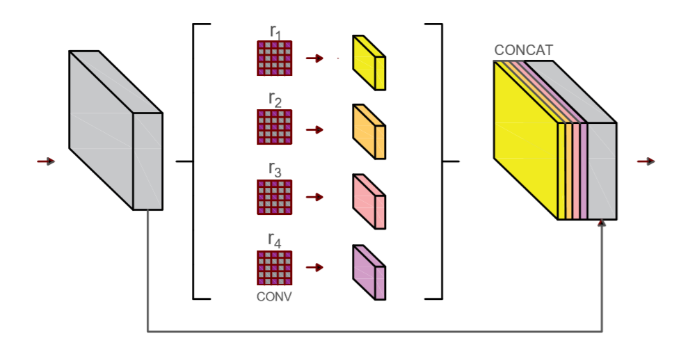
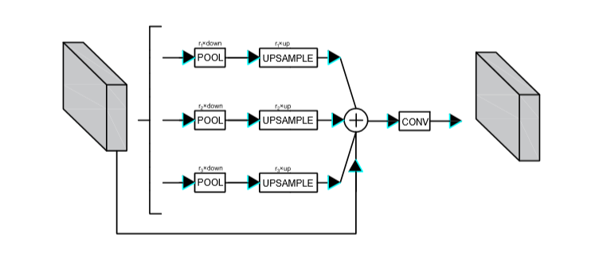

# net
### Abstracts
+ 在语义分割领域，将不同阶段的特征进行融合是常用的方法。低层特征具有较强的边界和纹理信息，而高层特征具有较强的语义信息，低层特征和高层特征具有较大的语义差距，直接将高层和低层特征进行融合会存在很大的噪声，直接融合并不能产生最好的效果。为了解决这个问题，我们遵循编码器和解码器的思想设计了一个并行金字塔网络，我们命名为NET。我们使用SEM来增强低层特征的特征值，使其具有更强的语义信息并缩短其与高层特征的语义差距。 我们使用PPM（金字塔池化模块）来聚合不同区域的上下文信息，并不断融合不同阶段的被SEM增强的特征（feature map）。将融合后的特征采用CAM来消除特征值融合后产生的噪声。最后，我们为了提取边界信息，设计了一个BEM在最后阶段获取边界信息并融合。我们在提出的并行金字塔网络中嵌入这四种模块从而达到对图像的精确分割。我们在三个数据集city、voc、camvid上进行实验验证我们网络的效果，最终都得到了最优的效果。
### 1.Introduce
+ 语义分割是计算机视觉领域一个非常活跃的研究方向，该技术的研究目的是对图像中的每个像素能够正确地预测出该像素属于的物体类别，它在视频监控、场景分析、人机交互以及行为分析等方面有着巨大的应用潜力。
+ State-of-the-art semantic segmentation are mostly based on the *fully convolutional network*(FCN).该方法的出色之处在于，其利用了现存的CNN网络作为其模块之一来产生层次化的特征。目前大多数的基于FCN的方法倾向于构建一个编码器分支来逐步获取语义信息，然后使用解码器来逐步恢复分辨率信息。experiences[24, 2, 3] show that ~~multi-scale~~（多阶段） information would help resolve ambiguous cases and results in more robust classification。为了捕捉多层次的上下文信息，跳跃连接在编码器和解码器的架构中经常被使用，跳跃连接将低层特征和高层特征进行融合，但是我们发现，这种架构存在很严重的问题，我们在使用跳跃连接来聚合特征时，没有考虑到低层信息和深层信息的语义鸿沟，直接将其进行融合会产生负面的效果。一些工作使用空洞卷积在使用低层特征前进行语义增强，缩短低层特征和高层特征之前的差距，但少有研究在特征融合后对融合后的特征值进行处理，消除融合后产生的噪声。我们展示一些feature heat map in Fig.1，
+ **写在图下作为解释：**(a),(b),(c)为FCN三个阶段不断加深的图(g)的热图，可以看出他们之前存在巨大的语义差距。(d)为(b)增强后的热图，其与(d)的差距明显小于(b)与(d)的差距。(e)为(b)和(c)做sum后产生的特征图。看出其噪声很大，产生了负面效果。(f)为(e)经过消除噪声的热图，(f)比(e)有更强的鲁棒性。

+ (a),(b),(c)是来自FCN三个阶段的特征图，我们发现越低层次的边界信息越明显，在fig(a)中我们很明显的能看出其边界和纹理（天空、柱子），但其干扰项太多，较为粗糙，不利于我们将其作为特征图进行精确分割。越深层次的特征(b)(c)边界信息越模糊，取而代之的是深层次的抽象的语义信息，其包含更多的鉴别和分类信息，可以用于分割。(e)展示了传统的跳跃连接将低层特征(b)和高层特征(c)sum后产生的结果，可以看出虽然特征图得到了加强，但其简单的sum后产生了很多噪声，产生了很多负面效果。所以，我们在特征融合时，不能忽略高层和低层特征之前的鸿沟。但目前工作很少有人提出解决方案。
+ 为了解决上述问题，我们认为在聚合不同阶段特征时，不能简单的将不同阶段的特征进行融合就进行使用。所以我们在使用不同阶段的低层特征前应尽可能的减少其与高层特征之间的语义差距。我们需要在融合不同尺度特征前后对特征图进行处理。在融合前我们应提高低层特征的语义信息，减小其边界和纹理信息，提取更强的语义信息，使得低层特征与高层之前具有较小的差异。在融合后，我们仍需要对融合后的特征图做处理，进一步消除噪声项。此外，我们发现最低层次的特征不利于做分割，但较低层的特征图被我们增强后会丢失大量边界信息，所以，我们需要一个模块来专门获取低层特征的边界信息。综上，我们提出了自己的网络来解决这个问题并提高分割性能。
+ our main contributions can be summarized as follow：
1. 提出了CAM模块用以消除不同层次特征图融合后产生的噪声
2. 一个BGM模块获取边界信息
3. 提出一个基于编解码的并行金字塔网络提高语义分割的性能
### 2.Relative Work
#### Encoder-Decoder
+ 在基于深度神经网络的图像语义分割方法中,比较经典的是编解码(Encoder-Decoder)结构的方法。该类方法的网络结构如图2所示。2014年, Long等提出的全卷积网络,是第一个使用类似编解码方法的网络。但由于其直接对原图进行填充,引入了噪声,且未考虑有用的上下文信息,导致分割精度不高,参数规模巨大,计算效率欠佳。2015年,基于FCN框架, Badrinarayanan等提出了SegNet网络 ,它是典型的编码-解码网络,用于道路、车辆的分割。该网络的优点在于池化层记录像素点的空间位置,在后续恢复图像分辨率时,能够有效地将其映射回对应位置,保留像素空间信息;然而,SegNet不能很好地识别物体轮廓,物体边缘的分割精度较差。此外, Noh等提出的DeconvNet对卷积层进行镜像处理,构成Encoder-Decoder结构,以编解码结构改善了FCN效果。随后, Hong等模仿DeconvNet,在FCN的基础上将卷积层与全连接层全部进行镜像处理,导致网络结构的参数规模很大,结果不如DeconvNet, Paszke等提出的ENet在卷积之间添加BN层和ReLU,依然采用Encoder-Decoder结构,分割效果较好。Yang等提出的CEDN,在使用Encoder-Decoder结构的同时,采用contour概率图结合MCG方法进行分割,效果良好,但速度较慢。
#### 基于多尺度信息的方法
+ 为了扩大感受野,有效地利用上下文信息,Yu等提出了空洞卷积(Dilated Convolutions)模型。该结构能够在避免空间层级化信息丢失的同时,保留图像的内部数据结构,解决了语义分割任务的瓶颈问题。Chen等和Wang等对空洞卷积进行了更详细的讨论。此后,研究者们发现多尺度可以使模型表现得更好。2017年,Chen等提出了DeepLabv2版本,增加了一个多视野域,打造多尺度以提高模型的表现力,该结构被称为基于空洞的空间金字塔(Atrous Spatial Pyramid Pooling, ASPP)。同年,Chen等提出的DeepLabv3在v2版本的基础上改进了ASPP模块,加入了1×1的卷积层和全局平均池化层。DeepLabv3使用空洞卷积与空间金字塔池化结构。但该方法较为粗糙,导致场景中的细节信息被忽略。针对当前语义分割丢失信息的问题。Zhao等提出的PSPNet也使用空洞卷积改善 ResNet结构,并添加了一个金字塔池化模块。
### NET
+ 在这一章节中，我们首先分别介绍SEM、BEM和CAM的实现细节，并在下文出我们的网络整体架构，展示如何将这些模块嵌入网络。最后我们介绍使用的loss函数
+ 1.SEM

+ 在特征融合前，我们首先对低层特征进行增强，缩短低层特征和高层特征之前的差距，提出了一种基于空洞卷积的低层特征增强模块。如第二章介绍的，chen等人使用ASPP增加了一个多视野域，,先使用小尺度卷积核获取局部特征,再用大尺度卷积核将特征分到更多区域中，可以在不丢失分别率的情况下指数级增大感受野。我们基于ASPP提出了自己的语义增强模块。不同于ASPP，我们不适用ASPP进行最终的预测，我们仅对浅层特征进行增强，提取更深层次的信息，所以我们没有使用很大的空洞卷积间隙，我们使用比较小的间隙来获得不同尺寸感受野的信息。我们有两个SEM，一个在resnet的第二输出阶段，一个在第三输出阶段，第一阶段的图片大小是第二阶段的两倍，所以我们SEM1使用的间隙大小为(3,6,9,12)，SEM2使用的卷积间隙大小为(2,4,6,8)。我们还使用一个跳跃连接来使得学习过程更容易。我们使用的空洞卷积核大小为3×3，每个分支的通道数为输入通道数的1/4，最终输出特征的通道数为输入特征图的2倍。对比图见图1
+ 2.BAM
+ 低层特征具有丰富的纹理、边界信息，我们在使用SEM对低层模块进行增强时，会丢失边界信息，第一章我们阐述了直接将低层信息sum后的结果，所以我们没有使用将低层特征直接融合的方法，而是提出了一种基于Attention的BEM来提取边界信息进行融合。如图
+ 我们基于逆向注意力机制和BAM的启发，我们提出了我们的BEM。
+ 3.CAM

+ 4.Overall
+ 5.Loss
